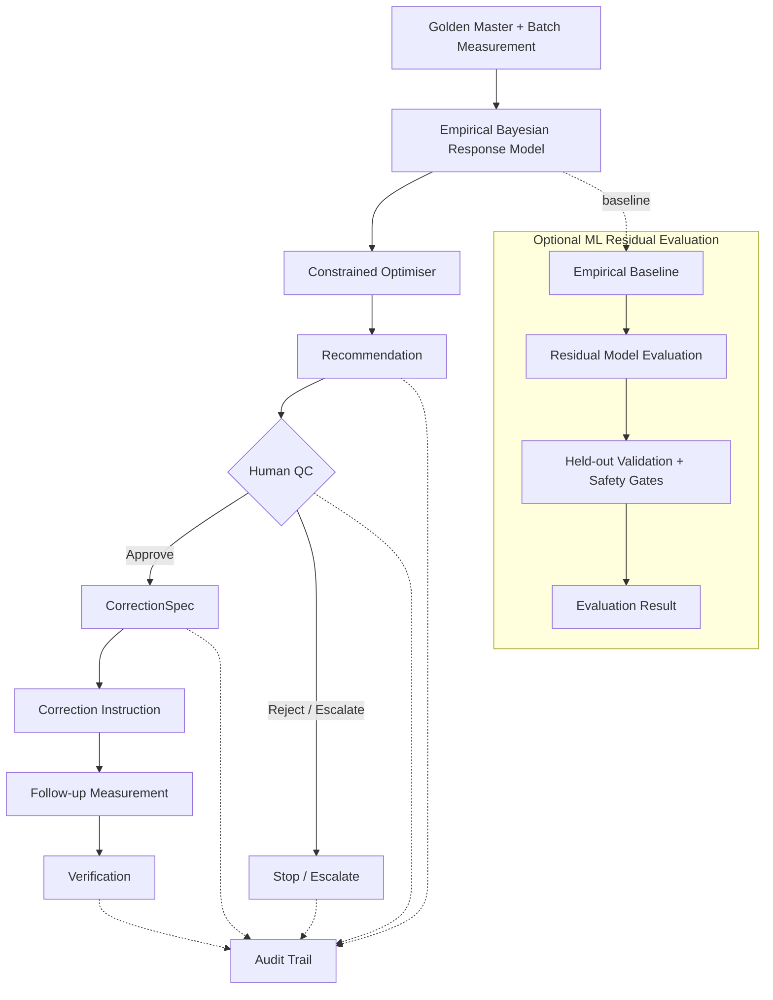

# 🏺 ATS Ceramic Assistant

### A synthetic-data prototype for measurement-driven ceramic tile shade calibration, combining empirical response modelling, constrained optimisation, confidence assessment, and human quality control.

[](https://www.python.org/)
[](https://streamlit.io/)
[]
[]

> **Experimental prototype — synthetic data only.** This project is not production-ready and has not been validated against client production data. It does not provide autonomous production release, automatic retraining, or live printer/RIP integration.

Repository: [Adro05/ats-ceramic-assistant](https://github.com/Adro05/ats-ceramic-assistant)

---

## 📑 Contents

- [Overview](#overview)
- [Key Features](#key-features)
- [Workflow](#workflow)
- [Technical Stack](#technical-stack)
- [Getting Started](#getting-started)
- [Design Notes and Limitations](#design-notes-and-limitations)
- [Testing](#testing)
- [Contributing](#contributing)
- [License](#license)

---

## 🔍 Overview

ATS Ceramic Assistant explores a measurement-driven workflow for ceramic tile shade calibration. It compares a preserved **Golden Master** with batch measurements, evaluates whether correction is appropriate, and—when supported by calibration evidence—uses an empirical response model to generate a bounded recommendation.

The workflow separates reference data, batch-specific correction, recommendation, human approval, and verification. The **empirical Bayesian response model remains the primary model**; an optional ML residual is evaluated separately and does not feed the current optimiser.

## ✨ Key Features

- **Immutable Golden Master:** Preserves the canonical reference instead of modifying it during batch correction.
- **Measurement-driven evaluation:** Compares colour measurements by region and considers relevant measurement metadata.
- **Empirical response modelling:** Uses a local Bayesian linear response model to estimate process sensitivity and uncertainty.
- **Constrained optimisation:** Produces bounded recommendations from explicitly represented controllable inputs and constraints.
- **Confidence and OOD assessment:** Identifies low-confidence or out-of-domain cases that may require escalation.
- **Human quality control:** Keeps approval decisions under human oversight.
- **Structured correction:** Represents approved changes through `CorrectionSpec` and a deterministic correction instruction.
- **Explicit verification:** Evaluates follow-up measurements against an acceptance criterion supplied by the caller.
- **Traceability:** Records defined workflow events in an audit trail.
- **Optional gated ML evaluation:** Keeps residual-model evaluation separate, subject to held-out validation and safety gates.

---

## 🔄 Workflow

The primary path uses the empirical Bayesian response model. The optional ML residual is evaluated separately as an experimental comparison against the empirical baseline; **it is not an input to the current constrained optimiser**.



### Workflow principles

- The Golden Master remains immutable; batch-specific corrections are represented separately.
- The empirical response model supplies the current optimiser.
- Recommendations are bounded and subject to confidence and eligibility checks.
- Human QC remains the approval authority; the workflow does not automatically release production batches.
- Verification is a separate step requiring a follow-up measurement and an explicit acceptance criterion.
- The optional ML residual is evaluated separately against the empirical baseline and does not alter the current optimiser's input path.

---

## 🧰 Technical Stack

| Technology | Role |
|---|---|
| Python | Application and modelling logic |
| Pydantic v2 | Domain validation and immutable models |
| NumPy / SciPy | Numerical computation and optimisation |
| pandas | Tabular data handling |
| scikit-learn | Optional residual-model evaluation |
| PyYAML | Configuration handling |
| Streamlit | Prototype interface |
| pytest | Automated testing |

---

## 🚀 Getting Started

### Clone the repository

```bash
git clone https://github.com/Adro05/ats-ceramic-assistant.git
cd ats-ceramic-assistant
```

### Install dependencies

Create and activate a Python virtual environment, then install the project and its declared dependencies:

```bash
python -m venv .venv
```

**Windows PowerShell**

```powershell
.\.venv\Scripts\Activate.ps1
```

**macOS / Linux**

```bash
source .venv/bin/activate
```

Install the project:

```bash
python -m pip install -e .
```

### Run the Streamlit prototype

```bash
streamlit run app.py
```

The interface provides synthetic scenarios for exploring correction recommendations, confidence assessment, and safety-oriented stop or escalation behaviour.

---

## 🛡️ Design Notes and Limitations

### Synthetic data only

Measurements, calibration observations, and demonstration configurations are synthetic. They do not establish performance on real production batches or validate the approach against client data.

### Empirical model first

The local Bayesian response model is the primary calibration model. Its estimates depend on relevant calibration observations and the applicability of those observations to the requested SKU and process context.

The optional ML residual is separate from the current optimisation path. Any consideration of operational use requires held-out validation and safety gates.

### Bounded, evidence-based recommendations

The optimiser operates on explicitly represented inputs and constraints. It does not assume unconfirmed printer channels, RIP settings, or other controllable process variables. The prototype does not establish client-specific tolerances or correction limits.

### Human approval and verification

A recommendation is not a production command. Human QC remains the final authority for approval or escalation, and the application does not provide autonomous production release.

Verification requires a follow-up measurement and a caller-supplied acceptance criterion. No client-specific ΔE tolerance is assumed.

### Scope boundaries

- No live printer or RIP integration.
- No automatic retraining.
- No production-readiness or production-accuracy claims.
- No camera-based CNN, GAN, or image-to-image model as the core calibration method.
- No Phase 1 kiln or raw-material causal modelling.
- Gloss is considered separately from colour difference, with region-level measurements retained where relevant.

---

## 🧪 Testing

Run the test suite with:

```bash
pytest
```

---

## 🤝 Contributing

1. Create a focused branch.
2. Add or update relevant tests.
3. Run `pytest`.
4. Open a pull request describing the change and its limitations.

Contributions should preserve Golden Master immutability, bounded optimisation, human QC, explicit verification, and the separation between empirical optimisation and optional ML evaluation.

---

## 📄 License

No license has been specified for this repository.